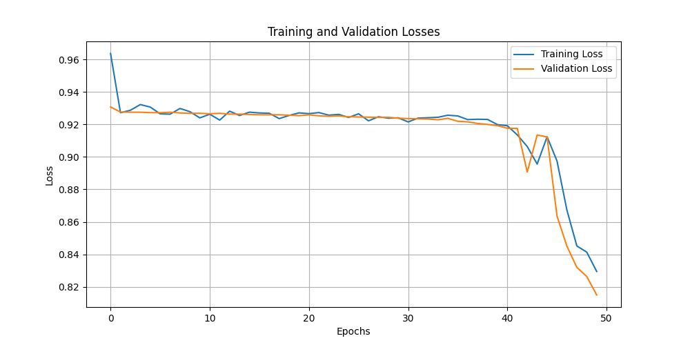
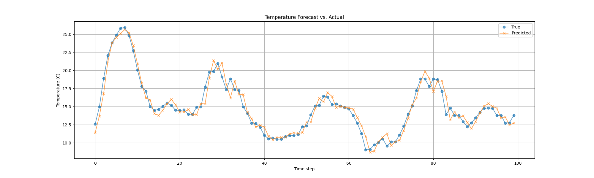

# RNN Applications

Live demo: [https://bindepzai-rnn-applications.streamlit.app/](https://bindepzai-rnn-applications.streamlit.app/)

This project demonstrates two practical applications of Recurrent Neural Networks (RNNs) implemented in PyTorch and deployed using Streamlit.

---

## 1. Financial News Sentiment Classification

This task uses an RNN-based model with 2 recurrent layers to classify financial news headlines into three sentiment categories:

- Positive
- Neutral
- Negative

### Features:

- Preprocessing: lowercasing, ASCII normalization, punctuation removal, stopword removal, stemming
- Model architecture:
  - Embedding layer
  - Two RNN layers
  - Layer normalization
  - Dropout and fully connected layers
- Evaluation: cross-entropy loss and classification accuracy

### Result:



---

## 2. Hourly Weather Forecasting

This task involves predicting the temperature of the next hour based on the previous 6 hourly temperature readings. It uses a 3-layer RNN model.

### Features:

- Input: a sliding window of 6 time steps from a univariate temperature time series
- Model architecture:
  - RNN with 3 layers
  - Layer normalization
  - Dropout and linear regression head
- Loss function: Mean Squared Error (MSE)
- Evaluation: actual vs. predicted temperature comparison

### Result:



---

## How to Run Locally

```bash
# Clone the repository
git clone https://github.com/your-username/rnn_applications.git
cd rnn_applications

# Install Python dependencies
pip install -r requirements.txt

# Run the app
streamlit run src/app.py
```
---
## 📁 Project Structure

```bash
.
├── src/
│   ├── app.py
│   ├── SentimentClassifier.py
│   ├── WeatherForecastor.py
├── models/
│   ├── problem1.pth
│   ├── problem2.pth
│   ├── vocab.pkl
├── data/
│   ├── all-data.csv
│   ├── weatherHistory.csv
├── plots/
│   ├── problem1.png
│   ├── p2_difference.png
├── requirements.txt
└── README.md

```
